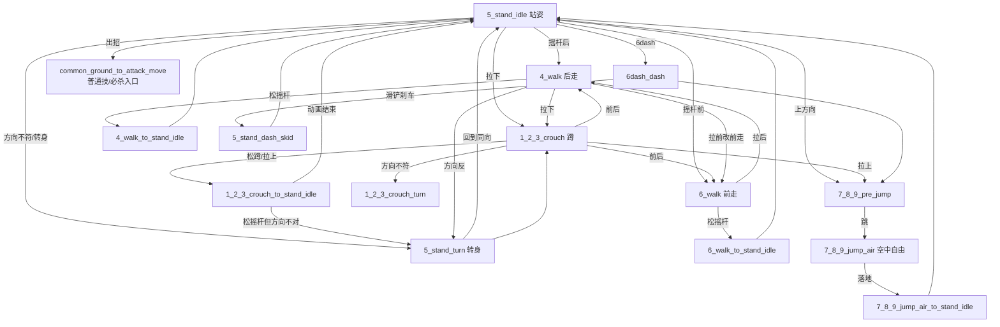
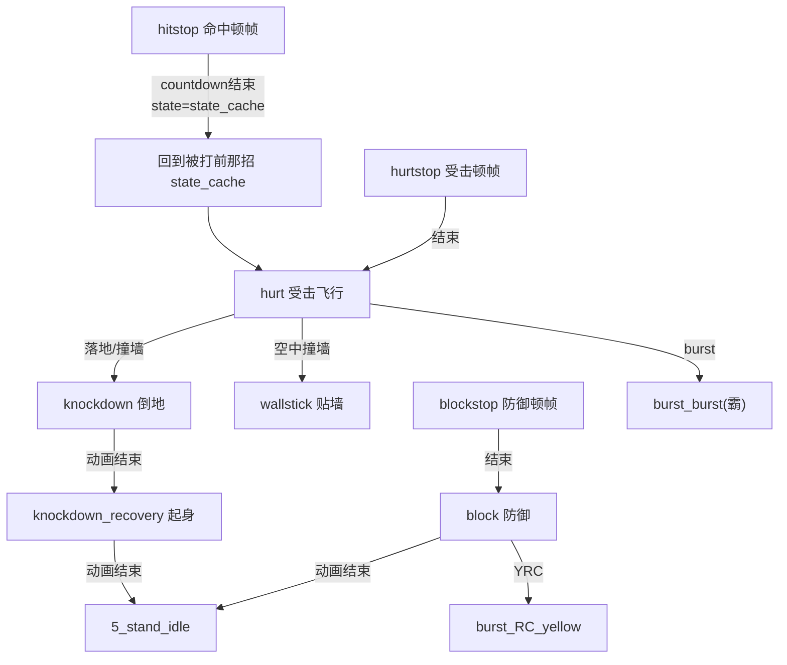

# TRM 角色格斗状态机 — 状态关系文档

> 版本: 2026-09-06 · 依据代码: `scenes/game_scene/characters/TRM/left.lua`(LP 侧)与 `right.lua`(RP 侧, 与 LP 完全镜像)
> 本文档的「每个状态能转移到哪些状态」均由脚本解析实现自动生成(`tools/analyze_state_machine.py`), 并以实现代码为准。
> 旧手写设计稿 `^state_machine_design_document.txt` 已过时, 差异见文末「与旧设计稿的差异」。

---

## 1. 总体架构

TRM 的战斗逻辑没有单个「状态 = 一张大表」的写法, 而是**逐状态的门函数(gate)分发**:

```
obj_char["state"] = "5_stand_idle"
        │
        ▼ 每帧
state_machine_char_game_scene_char_LP()          ← 主分发: switch[obj.state]
        │  按当前 state 找到对应函数
        ▼
(state 自己的帧处理: 播动画等)
state_gate_game_scene_char_LP_from_<当前状态>(...)  ← 状态门: 判断是否转去别的状态
        │  内部按「先高优先级、后低优先级」依次调用各种 helper
        ▼
(命中则直接 self_side_obj_char["state"]="新状态" 并 return true)
```

关键点:

- **主分发函数**: `state_machine_char_game_scene_char_LP/RP()`(`left.lua` L1680 / `right.lua` L1680)。它只做两件事: ①按 `obj["state"]` 查 switch 表执行该状态的帧逻辑; ②每帧更新 `update_game_scene_char_LP_uncommon_countdown()`。
- **状态门(gate)**: `state_gate_..._from_<state>()`, 一个状态对应一个门, 门内决定「什么时候、能否进入哪个新状态」。命中后直接改写 `obj["state"]` 并 `return true` 终止本帧判定。
- **公共门(common)**: `state_gate_..._common_<...>()`, 是**从任意姿态/状态起手**共用的一套「判定入口」, 例如 `common_ground_to_attack_move` = 「若按下任意地面普通技则进入对应状态」, 在多个状态门里被复用。
- 门函数**可互相调用**: `from_A` 内部经常会先切到中立态, 然后马上调用 `from_5_stand_idle`/`common_*` 再继续判断(实现「收招后立刻又能出下一招」)。
- 顶层注释写明的意图优先级(实现为各状态门内调用的先后顺序, 不一定每处都完全一致):
  > 拉后(后走/后撤)最高优先 → 拉下 → 拉前 → 跳 → 方向组合/普通技(由轻到重) → 必杀 → 超必杀 → OD/霸(爆发)。
  > `SP + 拉后` = 防御(拉盾 FD); `SP + Launcher` = 普通投。

LP / RP 两套完全同构, 只有对象/函数名的 `LP/RP` 与输入侧 `L/R` 不同, 下文一律以 LP 表述。

### 1.1 相关的几个状态机(都在 `left.lua`/`right.lua`)

| 函数 | 行(LP) | 作用 |
|---|---|---|
| `state_machine_char_game_scene_char_LP()` | 1680 | **主状态机**, 按 `obj.state` 分发到 94 个状态 |
| `state_machine_char_game_scene_char_LP_shot_sys()` | 2256 | 附属系统状态机(5H 法阵/oroboros/6SP_P 等射击物生命周期) |
| `state_machine_char_game_scene_char_LP_shot_sys_oroboros()` | 2381 | 5H 蛇腹(oroboros)附属物 |
| `state_machine_char_game_scene_char_LP_shot_sys_reticle()` | 2462 | 5H/4SP_S 的瞄准准星附属物 |
| `state_machine_char_game_scene_char_LP_input_sys_cache()` | 2612 | 输入缓存状态机(受击/防御等中断后重读输入) |
| `state_machine_char_game_scene_char_LP_input_sys_cache_negative_edge()` | 2706 | 负边沿(松开瞬间)输入缓存 |

### 1.2 状态如何被「写入」

自机状态(`obj["state"]`)只在两类地方被写入:

1. **主状态机的 from_ 门**(left.lua 3762 之后)——本机主动转态(出招、收招回中立、走路、跳跃、RC 等)。
2. **对方的命中代码**(`_anim.lua` 各招命中处理)写入**被打方**的 `opponent/hurt_side_obj_char["state"]`(例如被打进 `hitstop`→`hurt`→`knockdown`), 以及投技进入 `throw_*` 等。
3. `_character_function.lua` 等少量特殊位置(如投/搬运把角色切到 `7_8_9_jump_air`)。

> 也就是说: **防御/受击类关系的「进入边」大多写在对方的出招数据里**, 主状态机里只负责「在这些状态下每帧如何离开/处理」。
> 因此本文档里防御受击类状态给出的是「该状态下可做的事(逃生/起身/受身)」, 进入条件请反查各招命中数据。

---

## 2. 状态目录(94 个 dispatch 状态, 按功能分组)

### A. 开场 / 结束
- `before_ease_in`(开场, 只播动画), `knockout`(KO, 终结态)

### B. 防御
- `active_FD_block`(拉盾 FD 中), `active_FD_block_to_idle`(FD 松开回中立过场)
- `block`(普通防御), `blockstop`(防御硬直/顿帧)

### C. 受击 / 倒地
- `hitstop`(命中顿帧), `hurt`(受击), `hurtstop`(受击顿帧)
- `wallstick`(贴墙), `wallbreak_hurt` / `wallbreak_hit`(破墙, 命中/受击两方)
- `knockdown`(倒地), `knockdown_recovery`(倒地起身), `knockdown_recovery_wallstick`(贴墙倒地起身)
- `knockout`

### D. 投技(6 态)
- 投方: `throw_testing` → `throw_success`(成功) / `throw_teched`
- 被投方: `throw_tested` → `throw_hurt_success` / `throw_teching`(拆投)
- 技术拆投后: `throw_tech` 在代码中以 `from_throw_tech` 出现(处理 `throw_teching`/`throw_teched` 两态的通用门)

### E. 地面立回 / 移动
- 站姿: `5_stand_idle`, `5_stand_turn`, `5_stand_dash_skid`
- 蹲姿: `1_2_3_crouch`, `1_2_3_crouch_turn`, `1_2_3_crouch_to_stand_idle`
- 走路: `4_walk`, `4_walk_to_stand_idle`, `6_walk`, `6_walk_to_stand_idle`

### F. 跳跃 / 空中
- `7_8_9_pre_jump`(起跳前摇), `7_8_9_jump_air`(空中自由态), `7_8_9_jump_air_to_stand_idle`(落地收招回站姿)

### G. 冲刺
- 地面: `4dash_backdash`(后撤), `6dash_dash`(前冲), `6dash_dash_cancel`(冲刺取消态)
- 空中: `4dash_air_backdash`, `6dash_air_dash`

### H. RC / OD / Burst
- `burst_RC_red`(RRC 受击红色 RC), `burst_RC_blue`(BRC 蓝色), `burst_RC_purple`(PRC 紫色), `burst_RC_yellow`(YRC 防御黄色)
- `burst_overdrive`(OD), `burst_burst`(霸 / 爆发)

### I. 地面普通技(10+1)
- `2P, 6P, 5P, 2K, 6K, 5K, 2S, 6S, cS, fS`
- 大攻击: `2Launcher, 4_6Launcher, 5Launcher`
- `5H`(特殊指令技, 带 shot_sys 法阵/准星子系统)

### J. 空中普通技
- `j5P, j2K, j5K, j5S`、空中大攻击 `j4_6Launcher, j5Launcher`
- `j2S`: **已登记到 switch, 但没有 from_ 门也没有动画 loader —— 尚未实现(占位)**

### K. 必杀(地面)
- `4SP_P, 6SP_P, 4SP_K, 6SP_K, 4SP_S, 6SP_S`(已实现)
- `4SP_S` 派生(架式后出招): `4SP_S_4dash / 4SP_S_6dash / 4SP_S_4S / 4SP_S_H / 4SP_S_2Launcher / 4SP_S_6Launcher / 4SP_S_5Launcher / 4SP_S_6UA` —— 见 §3.6「已登记但未实现」

### L. 空中必杀 / 超必杀 / 固有技(UA)—— 全部尚未实现(占位)
- 空中必杀: `jSP_S, jSP_H, jSP_H_P, jSP_H_K, jSP_H_S, jSP_H_H`
- 超必杀(SP_H 系列): `SP_H, SP_H_P, SP_H_K, SP_H_S, SP_H_H`
- 固有技 UA: `4UA, 6UA, 5UA`
- `4SP_S_6UA`(4SP_S 架式派生 UA)

> 分类来源: `tools/classify_states.py` 输出 —— 94 个 dispatch 状态中:
> **8 个完全没有 from_ 门**: `before_ease_in, active_FD_block_to_idle, throw_teching, throw_teched, wallbreak_hurt, wallbreak_hit, knockout, j2S`
> **23 个 from_ 门为空(无自机转态逻辑)**: `active_FD_block, burst_burst, 4SP_S_4dash, 4SP_S_6dash, 4SP_S_H, 4SP_S_2Launcher, 4SP_S_6Launcher, 4SP_S_5Launcher, SP_H, SP_H_P, SP_H_K, SP_H_S, SP_H_H, jSP_S, jSP_H, jSP_H_P, jSP_H_K, jSP_H_S, jSP_H_H, 4UA, 6UA, 5UA, 4SP_S_6UA`
>
> 前 8 个多为「由对方/外部进入、没有自机主动离开逻辑」的受击/终结态(进入边的责任在攻击方); 后 23 个的**攻击类状态(SP_H 系列 / jSP 系列 / UA / 4SP_S 各派生)在 `_anim.lua` 中查不到动画 loader, 属于已登记未实现的占位**(旧设计稿里的派生在代码里大多被注释成 `-- _4UA` 等)。

---

## 3. 各分组内部的状态关系

### 3.1 地面立回/移动(状态 E 组)关系

中立地面对局(蹲姿/站姿/走路/转身/跳)的状态门彼此互指, 构成一个**互相可达的环**, 由输入(方向/键)驱动。蓝色为跳跃去路, 绿色为普通技/必杀入口(经 common 门)。



实测(from_ 门 `direct_self_state`)各中立态的**直接转态集合**:

| 源状态 | 可直接转到的状态(不含 common 复用) |
|---|---|
| `1_2_3_crouch` | `1_2_3_crouch_turn`, `1_2_3_crouch_to_stand_idle`, `4_walk`, `6_walk`, `7_8_9_pre_jump` |
| `1_2_3_crouch_turn` | `1_2_3_crouch`, `1_2_3_crouch_to_stand_idle`, `4_walk`, `6_walk`, `7_8_9_pre_jump` |
| `1_2_3_crouch_to_stand_idle` | `1_2_3_crouch`, `4_walk`, `5_stand_idle`, `5_stand_turn`, `6_walk`, `7_8_9_pre_jump` |
| `5_stand_idle` | `1_2_3_crouch`, `4_walk`, `5_stand_turn`, `6_walk`, `7_8_9_pre_jump` |
| `5_stand_turn` | `1_2_3_crouch`, `4_walk`, `5_stand_idle`, `6_walk`, `7_8_9_pre_jump` |
| `5_stand_dash_skid` | `5_stand_idle`, `7_8_9_pre_jump` |
| `4_walk` | `1_2_3_crouch`, `4_walk_to_stand_idle`, `5_stand_turn`, `6_walk`, `7_8_9_pre_jump` |
| `4_walk_to_stand_idle` | `1_2_3_crouch`, `4_walk`, `5_stand_idle`, `5_stand_turn`, `6_walk`, `7_8_9_pre_jump` |
| `6_walk` | `1_2_3_crouch`, `4_walk`, `5_stand_turn`, `6_walk_to_stand_idle`, `7_8_9_pre_jump` |
| `6_walk_to_stand_idle` | `1_2_3_crouch`, `4_walk`, `5_stand_idle`, `5_stand_turn`, `6_walk`, `7_8_9_pre_jump` |

**规律**:
- 除 `5_stand_idle` / `1_2_3_crouch` 外, 所有中立态都能在「松掉方向或条件满足」时回到站姿/蹲姿(`5_stand_idle` / `1_2_3_crouch`)。
- 蹲姿**不能**直接进 `7_8_9_pre_jump`? 能——蹲态可拉上起跳; 蹲/走/站互相转身(`*_turn` → 反方向同姿态)。
- 每个中立态都还**串联调用 common 门**(`ground_to_attack_move`, `ground_to_dash_move_hold_ver_6dash_only`, `to_burst_RC_blue`, `to_burst_overdrive`), 也就是说从中立态可以直接出普通技/必杀/前冲/BRC/OD, 见 §3.5。

### 3.2 跳跃/空中(状态 F、部分 G/H)关系

空中是另一个自由态枢纽 `7_8_9_jump_air`, 类似地面站姿。

| 源状态 | 直接转态 | 说明 |
|---|---|---|
| `7_8_9_pre_jump` | `7_8_9_jump_air` | 起跳前摇结束 |
| `7_8_9_jump_air` | `7_8_9_jump_air`(自身, 空中再行动/二段跳等), `7_8_9_jump_air_to_stand_idle`(落地) | 落地条件触发 |
| `7_8_9_jump_air_to_stand_idle` | `5_stand_idle` | 落地收招结束回站姿 |

空中自由态 `from_7_8_9_jump_air` 每帧还尝试:
- `common_air_to_attack_move_hold_ver` → 空中普通技入口(jP~j5Launcher)
- `common_air_to_dash_move_hold_ver_4dash_only` → 空中后撤
- `common_air_to_special_move` → 空中必杀(未实现)
- `common_to_burst_RC_blue`(BRC)、`common_to_burst_overdrive`(OD)

空中冲刺与后撤(落地自动落地收招):

| 源状态 | 直接转态 |
|---|---|
| `4dash_air_backdash` | `7_8_9_jump_air`, `7_8_9_jump_air_to_stand_idle` |
| `6dash_air_dash` | `7_8_9_jump_air`, `7_8_9_jump_air_to_stand_idle` |

### 3.3 地面冲刺与冲刺取消(状态 G)

| 源状态 | 直接转态 | 条件/说明 |
|---|---|---|
| `4dash_backdash` | `5_stand_idle` | 后撤结束回站姿(全程可被 BRC/OD 取消) |
| `6dash_dash` | `4dash_backdash`(转身再后撤?), `5_stand_dash_skid`, `7_8_9_pre_jump` | 前冲途中可取消入普攻(`common_ground_to_attack_move_hold_ver`)或跳 |
| `6dash_dash_cancel` | `5_stand_dash_skid` | **冲刺取消**态: 除回 `5_stand_dash_skid` 外, 可 `common_ground_to_special_move` 直接取消进必杀 |

> `6dash_dash_cancel` 是 TRM 的 dash-cancel 机制(见 repo 记忆 `trm_2k_fs_dash_cancel_gate`), 让普通技收招可通过 6dash 派生直接进入必杀(常见: `5K/cS → 6dash_dash_cancel → 4SP_S` 等)。

### 3.4 RC / OD / Burst(状态 H)关系

先看「进入」: 各 RC 从何而来, 是通过 common 门在相应状态里判定的——

| common 门 | 进入状态 | 一般使用场景(在哪些状态里被调用) |
|---|---|---|
| `common_to_burst_RC_red` → `burst_RC_red` | 受击红色 RC | `from_hurt`/受击打断(空中/地上被打中瞬间)、`from_hitstop` |
| `common_to_burst_RC_blue` → `burst_RC_blue` | 蓝色 RC | `from_5_stand_idle`/中立、`from_7_8_9_jump_air`/空中、各移动门 |
| `common_to_burst_RC_purple` → `burst_RC_purple` | 紫色 RC | 各**出招后**(普通技/必杀 `idle_cancel` 之外) |
| `common_to_burst_RC_yellow` → `burst_RC_yellow` | 黄色 RC | `from_block`/防御中、`from_active_FD_block`(FD 中) |
| `common_to_burst_overdrive` → `burst_overdrive` | OD | 很多状态都可用(type 参数区分 `overdrive`/`burst`) |
| (burst_burst) | 霸/爆发 | `from_hurt`/`from_block`/`from_hurtstop` 等调用时以 `"burst"` 传入 |

RC/OD 结束后(from_ 门)的统一去向(它们都回到中立并可继续行动):

| 源状态 | 直接转态 | 之后继续尝试 |
|---|---|---|
| `burst_RC_red` | `5_stand_idle`, `7_8_9_jump_air` | + 地面/空中全部 common(普攻/冲刺/必杀) |
| `burst_RC_blue` | 同上 | 同上 |
| `burst_RC_purple` | 同上 | 同上 |
| `burst_RC_yellow` | `5_stand_idle`, `7_8_9_jump_air` | 只 + 冲刺(dash)common, 不含必杀 |
| `burst_overdrive` | `5_stand_idle`, `7_8_9_jump_air` | 只 + 冲刺 common |
| `burst_burst` | —(门为空) | 见占位说明 |

> 语义: BRC/PRC/RRC 后角色获得**完全的再次行动权**(进任何普通技/必杀/冲刺); YRC/OD 后行动权较弱(仅可冲刺/移动), 与格斗游戏惯例一致(YRC 之后是防御有利 / OD 结束后有收招)。

### 3.5 地面普通技 / 必杀的取消与收招关系(状态 I、K 已实现部分)

这是出招-取消的核心。**每个出招状态的门, 结构都是同一套模板**(以 `from_2P` 为例, 由代码逐段可得):

```lua
function state_gate_..._from_2P(...)
    -- ① PRC: 出招中(非 idle_cancel 帧)可紫色 RC 打断
    if 可PRC then return end
    -- ② hit_cancel: 命中/可取消窗口内
    if obj["hit_cancel"] then
        -- 必杀取消(common_ground_to_special_move 优先于后续取消)
        -- 再按本招自己的 cancel 表逐条尝试(方向+按钮)
        --   2P 的链: 2P →(蹲P)6P →(6P)5P →(5P)6K →(6K)6S
        return
    end
    -- ③ idle_cancel: 出招进入收招可移动窗口
    if obj["idle_cancel"] then
        -- 冲刺/走路/蹲下移动取消(common_ground_to_dash_move_hold_ver_all)
        -- 转入相应中立态
        return
    end
    -- ④ 动画结束: 回到对应中立态(蹲招回蹲、站招回站)
    if 动画end then obj["state"]="1_2_3_crouch"/"5_stand_idle" return end
end
```

一个出招状态的四条去路可概括为:**PRC 打断 →(命中时)取消连段/必杀 →(收招时)移动取消 →(自然结束)回中立**。

**入口(中立 → 出招)**: 全部经过 `common_ground_to_attack_move`(普通技)+ `common_ground_to_special_move`(必杀)。后者其实是前者的**最优先分支**(普通技判定前先试必杀)。优先级序列(代码顺序):
1. 必杀 `4SP_P/6SP_P/4SP_K/6SP_K/4SP_S/6SP_S`(SP_H/UA 未实现不在此)
2. 普通技按 **P → K → S**、再 Launcher, 每个按钮先蹲/前方向组合再无方向:
   `2P→6P→5P→2K→6K→5K→2S→6S→cS(近身判距 360)→fS→2Launcher→4_6Launcher→5Launcher`
   (cS 额外要求距离 `collision_test_cS_distance_check(...,360)`; fS 不要求)

**取消链表(命中窗口内, 从各 from_ 门直接转态)** —— 每个普通技「命中后可接」的目标状态:

| 出招 | 命中可接(取消链) | 收招可移动取消 | 自然收招回 |
|---|---|---|---|
| `2P` | `2P 6P 5P 6K 6S`(+必杀) | 冲刺/蹲 | `1_2_3_crouch` |
| `5P` | `2P 5P 6K 6P 6S`(+必杀) | 同上 | `5_stand_idle` |
| `2K` | `2Launcher 5Launcher 6K 6S`(+必杀) | 同上 | `1_2_3_crouch` |
| `5K` | `2K 6K 6P 6S 2Launcher 5Launcher 6dash_dash_cancel`(+必杀) | 同上 | `5_stand_idle` |
| `6K` | (+必杀) | 同上 | `5_stand_idle` |
| `6P/6S/fS` | (+必杀) | 同上 | `5_stand_idle` |
| `2S` | (+必杀) | 同上 | `1_2_3_crouch` |
| `cS` | `2S 6K 6P 6S fS 2Launcher 5Launcher 6dash_dash_cancel`(+必杀) | 同上 | `5_stand_idle` |
| `2Launcher` | (+必杀) | 同上 | `1_2_3_crouch` |
| `4_6Launcher / 5Launcher` | (命中把对方打浮空, 之后常见接空连; 必杀取消较少) | 同上 | `5_stand_idle` |
| `6P/6K/6S/fS` 等「可入青 RC 系」 | 见备注 | — | — |

> 备注:
> - `6P/6K/6S/4_6Launcher/5Launcher/6SP_P/4SP_K/6SP_K/6SP_S` 的门里直接转态通常只有回中立(不写 hit_cancel 链), 因为它们的定位是「单发/收招后可继续压制」; 具体能否接取决于命中处理里设置的 `hit_cancel` 窗口(写在 `_anim.lua` 帧数据里, 不由主状态机决定)。
> - 出招中**始终优先判断 PRC**(`common_to_burst_RC_purple`), 只有非 idle_cancel 时才允许 —— 对应「出招被紫 RC 取消」。
> - 命中取消判定需要 `obj["hit_cancel"] == true`; 移动取消需要 `obj["idle_cancel"] == true`。这两个标志由各招动画数据(激活帧/收招帧)设置。

### 3.6 `4SP_S` 架式(必杀派生枢纽)

`4SP_S`(诅咒法阵架式)是**带派生**的必杀: 架式状态里可派生多方向必杀/UA/位移。当前代码状态:

| 派生 | 代码现状 |
|---|---|
| → `4SP_P`(4/1+P), → `6SP_P`(6+P) | 已实现(直接转态) |
| → `4SP_K`(4+K), → `6SP_K`(6+K) | 已实现; `6SP_K` 额外要求场上无 scapegoat(`shot_sys_scapegoat_exist == false`) |
| → `4SP_S_4S`(4+S) | **已实现但状态名不一致**: 写的是 `state = "4SP_S_4S"`, 而 dispatch 表与门函数名为 `4SP_S_4S`、动画 loader 为 `load_game_scene_anim_char_TRM_4SP_S_4S` → 见 §6 待核对项 |
| → `4SP_S_4dash / 4SP_S_6dash / 4SP_S_H / 4SP_S_2Launcher / 4SP_S_6Launcher / 4SP_S_5Launcher / 4SP_S_6UA / 4UA / 5UA` | **占位**: 代码里是 `-- _4UA` 等注释, 门为空, `_anim.lua` 无对应 loader |

`4SP_S` 门自身的转态: PRC(紫 RC)→ 派生列表 →(架式结束)未回到中立(门里没有 idle 收招回中立, 现状依赖派生或被打断离开)。`4SP_S_4S` 的门(`from_4SP_S_4S`)是**有内容的**, 动画结束后回 `5_stand_idle`, 但因为上面状态名写错, 这个门目前不会被走到。

### 3.7 空中普通技关系(状态 J)

空中普通技的门结构与地面一致, 但「自然收招」不是回中立, 而是:**落地(`7_8_9_jump_air_to_stand_idle`)或回到空中自由态 `7_8_9_jump_air` 以便继续空中行动**(再按/空中冲刺)。

| 出招 | 直接转态(命中链 + 落地/回空) | 备注 |
|---|---|---|
| `j5P` | `j5P j2K j5K j5S` / `jump_air`, `jump_air_to_stand_idle` | 空中 P 链 |
| `j2K` | `j2K j5K j5Launcher j5P j5S` / 落地/回空 | 踩头跳等 |
| `j5K` | `j2K j5P j5S` / 落地/回空 | |
| `j5S` | `j2K j5K j5P` / 落地/回空 | |
| `j4_6Launcher` | 落地/回空 | 空中投/吹飞技 |
| `j5Launcher` | 落地/回空 | |

入口: `common_air_to_attack_move(_hold_ver)` 按 `j5P/j2K/j5K/j5S/j4_6Launcher/j5Launcher` 顺序; `j2S` 与空中必杀 `jSP_*` 尚未实现, 不在入口里。

### 3.8 防御 / 受击 / 倒地(状态 B、C)关系

这一组是「被打方」状态。**进入边在攻击方代码里**(命中→ `hitstop`/`hurt`/`knockdown`; 防住→ `block`/`blockstop`; 破墙→ `wallbreak_*`)。主状态机里只实现「每帧如何离开」:



关键关系:

| 源状态 | 能做的转态 | 触发 |
|---|---|---|
| `hitstop` | → `state_cache`(回到被打前那招) 或 → `burst_RC_red` / `burst_overdrive` | 顿帧倒计时 ≤0 时 `state = state_cache` 并 `physics_lock=false`、重载输入缓存; OD/RRC 逃生在恢复后判断 |
| `blockstop` | → `state_cache` → `burst_overdrive` | 同上 |
| `hurtstop` | → `state_cache` → `burst_overdrive` | 同上 |
| `block` | → `5_stand_idle`/`1_2_3_crouch`(动画结束), 中途可 `burst_burst`(霸)、`burst_RC_yellow`(YRC)、并复用地面移动门 | 防完回中立; FD 见 `active_FD_block` |
| `hurt` | 空中→撞墙/落地转 `knockdown`/`knockdown_recovery`; 落地后动画结束→回站/蹲中立; 可 `burst_burst`(霸)/OD | 受击逃生(霸)与受身 |
| `wallstick` | (门空, 依赖后续命中/落地处理) | — |
| `knockdown` | → `knockdown_recovery`(动画结束), 可 `burst_overdrive` | |
| `knockdown_recovery` | → `5_stand_idle`(动画结束), 可 OD/前冲 | 起身后可立刻移动(`common_ground_to_dash_move_hold_ver_all`) |
| `knockdown_recovery_wallstick` | → `5_stand_idle`/`7_8_9_jump_air`, 可前冲 | 贴墙起身 |
| `wallbreak_hurt` / `wallbreak_hit` | 门空(无 from_ 门) | 破墙演出由外部驱动 |
| `active_FD_block` | 门空 | FD 中; 靠 `active_FD_block_to_idle`/外部结束 |
| `active_FD_block_to_idle` | 无 from_ 门 | FD 松开回中立过场(占位/WIP) |

> 逃生与霸: `hurt` / `block` / `hurtstop` 都以 `"burst"` 作为 type 调用 `common_to_burst_overdrive`, 命中即进入 `burst_overdrive`(受击霸)/`burst_burst`。

### 3.9 投技(状态 D)关系

投的 6 个状态在攻击方与被投方之间配对:

| 角色 | 状态流 | 说明 |
|---|---|---|
| 投出方 | `throw_testing`(判定中) → 命中 `throw_success` / 被拆 `throw_teched` | `from_throw_testing` |
| 被投方 | `throw_tested`(判定中) → 中投 `throw_hurt_success` / 拆投 `throw_teching` | `from_throw_tested` |

`from_throw_success`(投成功后): 直接回 `5_stand_idle`/进空中, 并可复用地面/空中全部移动与必杀门 + PRC/RRC —— 即**投完后仍保有行动权**(后续连段/起攻由投的硬直处理)。
`from_throw_tech`(拆投, 同时服务 `throw_teching`/`throw_teched` 两态): → `5_stand_idle`/`7_8_9_jump_air`, 可前冲(拆投后有利移动)。

---

## 4. 主状态机内部结构速览(便于读代码)

- `left.lua` 各段:
  - 2612 / 2706: `input_sys_cache` 与负边沿状态机(被打/防御后重读输入);
  - 2740 ~ 3752: **common 门**(20 个): 地面/空中的 dash、attack、special、RC 4 色、OD;
  - 3752 ~ 3762: `to_5H` 门(从 `5_stand_idle` 直接进 `5H`);
  - 3762 ~ 6926: 各 `from_<状态>` 门(87 个 from + 1 个 to)。
- 主分发函数 switch 里, `5_stand_idle` 分支是唯一的特例: 除 `from_5_stand_idle` 外**还额外调用一次 `state_gate_..._to_5H`**(5H 是站姿专属特殊技)。

---

## 5. 状态转移速查(实现自动提取的汇总)

「源 → 目标」只看**直接转态 + 每帧调用的 common 门所能进入的状态**(可视为「该状态能去往的潜在目标集」), 供对照。省略受击/防御类(见 §3.8)。

| 源状态 | 可达(直接或经 common) |
|---|---|
| `5_stand_idle` | `5_stand_turn, 1_2_3_crouch, 4_walk, 6_walk, 7_8_9_pre_jump, 6dash_dash, 4dash_backdash, 2P..5Launcher, 4SP_P..6SP_S, burst_RC_blue, burst_overdrive, 5H`(to_5H) |
| `1_2_3_crouch` | `1_2_3_crouch_turn, 1_2_3_crouch_to_stand_idle, 4_walk, 6_walk, 7_8_9_pre_jump, 6dash_dash, 2P..5Launcher, 4SP_P..6SP_S, burst_RC_blue, burst_overdrive` |
| `5_stand_turn` / `4_walk` / `6_walk` / 各 `*_to_stand_idle` | 同类中立环 + 同上出招 |
| `5_stand_dash_skid` | `5_stand_idle, 7_8_9_pre_jump` + 出招 |
| `7_8_9_jump_air` | `7_8_9_jump_air_to_stand_idle, 7_8_9_jump_air`(空动) + `j5P..j5Launcher`, `4dash_air_backdash`, `6dash_air_dash`, `burst_RC_blue`, `burst_overdrive` |
| `7_8_9_pre_jump` | `7_8_9_jump_air` |
| `4dash_backdash` | `5_stand_idle` (+RC/OD) |
| `6dash_dash` | `5_stand_dash_skid, 7_8_9_pre_jump, 4dash_backdash` + 出招 |
| `6dash_dash_cancel` | `5_stand_dash_skid` + `4SP_P..6SP_S`(必杀取消) |
| `4dash_air_backdash` / `6dash_air_dash` | `7_8_9_jump_air, 7_8_9_jump_air_to_stand_idle` |
| `burst_RC_*`(红蓝紫) | `5_stand_idle, 7_8_9_jump_air` + 地面/空中全出招 + 冲刺 |
| `burst_RC_yellow` / `burst_overdrive` | `5_stand_idle, 7_8_9_jump_air` + 冲刺 |
| `5K` / `cS` | 回中立 + 命中链 + `6dash_dash_cancel` + 必杀 |
| `2K` / `2P` / `5P` / `2S` / `fS` 等 | 回蹲/站中立 + 各自的命中链 + 必杀 |
| `4SP_S` | PRC + 派生(`4SP_P, 6SP_P, 4SP_K, 6SP_K, 4SP_S_4S`) |
| `6SP_P` / `4SP_K` / `6SP_K` / `6SP_S` | 回 `5_stand_idle` / `1_2_3_crouch` + PRC |

---

## 6. 与旧设计稿 `^state_machine_design_document.txt` 的差异 & 待核对项

旧稿是早期手写目标, 与当前实现有以下**已知出入**:

1. **命名漂移**
   - 旧稿把跟随取消写成 `_4SP_S_4P/6P/4K/6K/4SP_S_4S/_4SP_S_SP_H||_4SP_S_H` 等。当前实现 `from_4SP_S` 直接复用同名必杀状态(`4SP_P/6SP_P/4SP_K/6SP_K`), 并不单独开 `4SP_S_4P` 等派生态。
   - 旧稿 `_6k` 小写笔误 → 代码为 `6K`。
2. **旧稿列了、代码已删/改**: 旧稿的 `4SP_S_4UA`, `_2UA`, `_j6UA`, `_j2S`(当作会实现)…… 当前 `UA` 系列全部是占位; `j2S` 登记但未实现。
3. **旧稿标了、代码尚未实现(占位, `_anim.lua` 无 loader)**:
   `SP_H(+P/K/S/H)` 超必杀、`jSP_S/jSP_H(+P/K/S/H)` 空中必杀、`4UA/6UA/5UA` 固有技、`4SP_S` 的 `_4dash/_6dash/_H/_2Launcher/_6Launcher/_5Launcher/_6UA` 派生(代码中以 `--` 注释保留)。
4. **命中/防住后的转态差异以代码为准**: 旧稿 `_hurt → _knockdown/_knockdown_recovery` 由受击代码实现, 主状态机的 `hurt` 门只负责逃生/起身, 与旧稿一致但实现位置不同。
5. **待核对(疑似 bug)**: `from_4SP_S` 里 4S 派生写成 `self_side_obj_char["state"] = "4SP_S_4S"`, 但 dispatch switch 的键名是 `"4SP_S_4S"`(门函数也是 `from_4SP_S_4S`)。这样进入派生后主分发查不到 `"4SP_S_4S"`, 该帧不会执行任何状态逻辑 —— 建议把写入改成 `"4SP_S_4S"`, 或把 dispatch/门统一改成 `4SP_S_4S`。
6. **旧稿的架构名** `_common_ground_idle_to_move` 等是「抽象名」, 代码实际拆成多个 `common_ground_to_dash_move*` / `common_ground_to_attack_move` / `common_ground_to_special_move` 等 20 个 common 门, 顺序即优先级。

---

## 7. 附: 生成方式

- 解析脚本: `tools/analyze_state_machine.py`(读 `left.lua` / `right.lua`, 输出 `tools/state_machine_analysis.json` + `tools/state_machine_report.txt`)
- 占位分类: `tools/classify_states.py`
- 复现: 从仓库根执行 `python tools/analyze_state_machine.py && python tools/classify_states.py`
