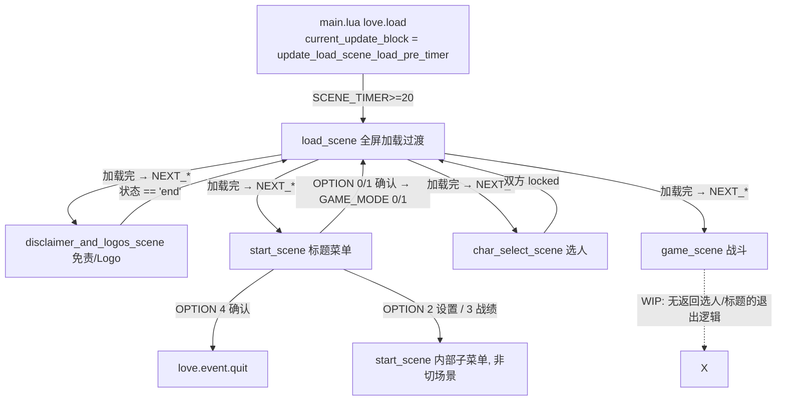

# 场景级状态流 / 状态机关系文档

> 版本: 2026-09-06 · 范围: 顶层场景切换 + 各场景 `state_machine.lua` 中的对象状态机
> 依据代码: `main.lua`、`scenes/*/main_blocks.lua`、`scenes/*/state_machine.lua`、`scenes/*/load_function.lua` 等。

---

## 1. 顶层场景切换机制(不是一张 SCENE 枚举表)

仓库**没有** `SCENE`/`scene_state` 之类的全局枚举, 场景切换由 **函数指针 block swap** 完成:

- `current_update_block()` / `current_draw_block()` —— 每帧唯一活动的 update/draw 入口(`main.lua` 的 `love.update/draw` 只调这两个)。
- `NEXT_UPDATE_BLOCK` / `NEXT_DRAW_BLOCK` / `NEXT_PRESET` —— 目标场景的入口/出场函数指针, 由 `load_<场景>_prep()` 预置。
- `SCENE_TIMER` —— 全局帧计数, 每个子块退出时清零(场景时钟)。
- `load_scene` 不是「一关」, 而是**每次切场景都经过的全屏加载过渡**。
- 跨场景全局携带: `GAME_MODE`(0 训练 /1 本地 /2 联机)、`OPTION_ID`、`PLAYER_NUMBER`、`CHAR_SELECT_LR["L"/"R"]`、`CONTROL_METHOD["L"/"R"]`。

### 场景切换标准三连(每个场景退出时都调用)
1. `load_<下一场景>_prep()` —— 懒加载下一场景模块, 预置 `NEXT_*`, 并**开线程后台加载资源**;
2. `load_scene_prep_routine()` —— 进入全屏 load 画面, 加载完成后自动切到下一场景入口;
3. `unload_<当前场景>_all()` —— 清理当前场景 `_G` 中带前缀的全局、`unrequire` 其模块。

### 顶层流程



| 场景 | 入口(update block) | 出口条件 | 出口动作 |
|---|---|---|---|
| disclaimer_and_logos | `update_disclaimer_and_logos_scene_main` | 状态机 `state == "end"` | → `load_start_scene_prep()` |
| start_scene | `update_start_scene_ease_in` | ease_out SFX 结束, 按 `OPTION_ID` | `[0]`训练(`PLAYER_NUMBER=1`)、`[1]`2P(`PLAYER_NUMBER=2`)→`GAME_MODE` → char_select; `[4]`退出 |
| char_select | `update_char_select_scene_ease_in_0f_36f` | 双方 `select_state=="locked"` | → `load_game_scene_prep()` |
| game_scene | 按 `GAME_MODE`: 训练/本地/联机各自 `*_before_ease_in` | **未实现** | — |
| load_scene | 4 个子块链(见下) | ease-out 完 | `NEXT_PRESET()` 提交切换 |

### load_scene 加载过渡内部链(main_blocks)
`update_load_scene_load_pre_timer`(`≥20f`, 开机引导) → `update_load_scene_ease_in` → `update_load_scene_general`(等 `LOADING_FUNCTION_AMOUNT==0 && ≥60f`, 资源经 `run_table_order_load()` 流式加载) → `update_load_scene_ease_out` → `NEXT_PRESET()` 提交。

---

## 2. 各场景内对象状态机(`state_machine.lua`)

每个场景的 `state_machine.lua` 只放**很小的、持续更新同一对象的 UI 状态机**, 场景骨架在主 `main_blocks.lua` 里(不在 state_machine.lua)。

### 2.1 disclaimer_and_logos_scene(1 个状态机)
`state_machine_UI_disclaimer_and_logos_scene_singular(obj)` —— 三张卡(免责声明 → Kuroe Taro 手工 Logo → LÖVE Logo), 用 `obj[8]` 切图, `K` 键(跳过)+ `SCENE_TIMER` 驱动, 全程 ease in/out 透明度过渡。

```
pre_disclaimer_ease_in ──SCENE_TIMER≥10 或 K按下──▶ disclaimer_ease_in
disclaimer_ease_in ──动画完──▶ disclaimer_update
disclaimer_ease_in ──K按下(跳过)──▶ disclaimer_ease_out
disclaimer_update ──≥120f 或 K按下──▶ disclaimer_ease_out
disclaimer_ease_out ──动画完/K──▶ kuroe_taro_s_handicraft_logo_ease_in (换图8=1)
... (每张 Logo 同样 ease_in→update→ease_out 三段) ...
love_logo_ease_out ──▶ end (终结, 触发场景退出 → 标题)
```

### 2.2 start_scene(2 个状态机)
- `state_machine_UI_start_scene_noise_BG_static_loop(obj)` —— 噪点背景帧循环(4 tick/帧, `8>49` 回 0)。无状态。
- `state_machine_UI_start_scene_config_controller(obj,input_id)` —— 设置→手柄子菜单的「按住显示」标记(LP/RP 各一):
  `off_state ⇄ ease_in ⇄ on_state ⇄ ease_out`(按 `K` 按住亮起、松开变暗, 以 ease 动画切换)。

### 2.3 load_scene
`state_machine.lua` 仅 2 行注释, **没有函数**(加载流程全在 `main_blocks.lua` 的 4 子块, 见上)。

### 2.4 char_select_scene(最复杂, 10 个状态机)
**A. 通用/琐碎**: `movie_cover_loop`(片头遮罩帧循环)、`start_0f_110f`(开场计数)、`timer`(选人倒计时, 60f 进位, 到 00:00 停)、`ring_blink`(圆环随机闪烁)。

**B. 对战选人 — `state_machine_UI_char_select_scene_char_select(input_id)`**(L/R 各一个, 驱动游标/立绘/图标/操作方式):
主状态 `select_state`:

```
idle ──K确认──▶ selecting ──动画完──▶ selected ──K──▶ locking ──动画完──▶ locked(终结)
   ▲                │  H取消                      H  ▲
   └──动画完(unselecting)◀── H ────────────────────┘
   locked 仅由外部(main_blocks)重置为 unlocking → selected
```
- 每帧内部再跑 2 个子状态机:
  - `char_select_ease(...)`(`ease_state`): 左右移动游标选择角色, `ease_in ⇄ ease_out`; 仅在 idle/unselecting 可移动, `CHAR_SELECT_LR[input_id]` 8↔1 循环。
  - `char_select_bar_mark_select(...)`(`obj_bar_mark.state`): 上下切换操作方式(`CONTROL_METHOD` 1↔0), `idle ⇄ up_twitch/down_twitch`, 仅在 selecting/selected 可用。

**C. 训练用木桩 — `char_select_train_dummy()` 及其 ease/bar_mark 变体**: 与 B 几乎同构, 但**用 L 侧输入操作 R 侧对象**(训练模式单人选完自己后选木桩), 写 `CHAR_SELECT_LR["R"]`。

**选人收尾**:
- 对战(`GAME_MODE≠0`): 两边各自 `locked` → main_blocks → ease_out → 进 load_scene → game_scene。
- 训练(`GAME_MODE==0`): L 到 `locking` 时把角色镜像到 R(`CHAR_SELECT_LR["R"]=L`), 再进木桩选择阶段; 木桩也 `locked` → 同上。
- `H` 取消: 从木桩选择返回主选人并解除 L 锁定。

### 2.5 game_scene(仅 UI 层)
- `state_machine_UI_game_scene_HUD_ACT_common(obj,length)` —— HUD "ACT" 计数器(推进到 `length-1` 停)。
- `state_machine_UI_game_scene_movie_cover_loop(obj)` —— 遮罩帧循环(0..9)。
- 战斗中的**角色/相机/舞台**状态机不在此文件: TRM 角色主状态机见 `docs/TRM_character_state_machine.md`; 舞台有 `stage/alpha.lua` 的 `state_machine_stage_game_scene_camera()` 与 `state_machine_stage_game_scene_wallstick()`。

---

## 3. WIP / 占位说明

- `load_scene/state_machine.lua`: 纯注释, 无函数。
- game_scene **无退出路径**: `unload_game_scene_all()` 已定义但从未被调用; KO 后回选人/标题未实现。
- `update_game_scene_local_match_before_ease_in` / `update_game_scene_online_match_synchronizing`: 仅为跑角色更新的 stub(本地/联机对战流程未做)。
- `preset_disclaimer_and_logos_scene()`: 空 stub(用于标准化 load scene 的占位)。
- 实际被调用的卸载函数只有 disclaimer / start / char_select 三个场景各自退出时的 `unload_*_all()`。
